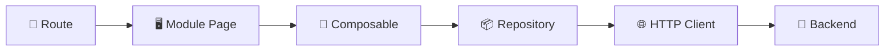

# 🚀 Nuxt Modular Monolith Template

   

Este projeto foi criado para servir como base de aplicações corporativas escaláveis, priorizando simplicidade operacional, organização por domínio e evolução sustentável de longo prazo.

---

# ⚡ Getting Started

Suba o projeto em menos de 60 segundos.

## Instalar dependências

```bash
pnpm install
```

## Executar localmente

```bash
pnpm dev
```

ou

```bash
pnpm --filter web dev
```

Aplicação disponível em:

```text
http://localhost:3000
```

## Criar sua primeira feature

```bash
pnpm create:feature banking
```

---

# 📑 Sumário

- [🚀 Nuxt Modular Monolith Template](#-nuxt-modular-monolith-template)
- [⚡ Getting Started](#-getting-started)
  - [Instalar dependências](#instalar-dependências)
  - [Executar localmente](#executar-localmente)
  - [Criar sua primeira feature](#criar-sua-primeira-feature)
- [📑 Sumário](#-sumário)
- [🏛️ Arquitetura em 10 segundos](#️-arquitetura-em-10-segundos)
- [🎯 Objetivos](#-objetivos)
- [🧭 Princípios Arquiteturais](#-princípios-arquiteturais)
- [📚 Documentação](#-documentação)
- [🛠️ Stack e Ferramentas](#️-stack-e-ferramentas)
    - [Core Framework](#core-framework)
    - [Qualidade de Código](#qualidade-de-código)
    - [Testes](#testes)
    - [Arquitetura](#arquitetura)
    - [Developer Experience](#developer-experience)
- [🎯 Principais Decisões](#-principais-decisões)
- [🗂️ Estrutura do Projeto](#️-estrutura-do-projeto)
- [⚙️ Core](#️-core)
- [♻️ Shared](#️-shared)
- [🧩 Estrutura de um Módulo](#-estrutura-de-um-módulo)
- [🔒 Regras Arquiteturais](#-regras-arquiteturais)
    - [Permitido](#permitido)
    - [Não permitido](#não-permitido)
- [🛣️ Rotas](#️-rotas)
- [🧰 Developer Toolkit](#-developer-toolkit)
- [📦 Scripts Disponíveis](#-scripts-disponíveis)
- [🧪 Qualidade](#-qualidade)
- [📝 Commits](#-commits)
- [🤝 Contribuindo](#-contribuindo)
- [📄 Licença](#-licença)

---

# 🏛️ Arquitetura em 10 segundos

Fluxo recomendado:



---

# 🎯 Objetivos

Este template foi criado para:

* Organizar funcionalidades por domínio de negócio
* Evitar acoplamento entre áreas da aplicação
* Facilitar manutenção de longo prazo
* Melhorar onboarding de novos desenvolvedores
* Reduzir decisões repetitivas
* Fornecer uma base consistente para múltiplos produtos
* Escalar sem aumentar a complexidade operacional

---

# 🧭 Princípios Arquiteturais

Esta arquitetura foi construída sobre os seguintes princípios:

* Organização por domínio
* Alta coesão
* Baixo acoplamento
* Simplicidade operacional
* Evolução incremental
* Separação clara de responsabilidades
* Developer Experience em primeiro lugar
* Modularidade sem distribuição prematura

---

# 📚 Documentação

| Documento                                              | Descrição                            |
| ------------------------------------------------------ | ------------------------------------ |
| [Architecture](./docs/architecture.md)                 | Visão geral da arquitetura           |
| [Module Guidelines](./docs/module-guidelines.md)       | Convenções para módulos              |
| [Development Workflow](./docs/development-workflow.md) | Fluxo recomendado de desenvolvimento |
| [Generators](./docs/generators.md)                     | Ferramentas de geração automática    |
| [Contributing](./docs/contributing.md)                 | Processo de contribuição             |
| [ADRs](./docs/adr)                                     | Registro das decisões arquiteturais  |

---

# 🛠️ Stack e Ferramentas

### Core Framework

| Tecnologia     | Papel                  |
| -------------- | ---------------------- |
| Vue 3          | Framework UI           |
| Nuxt 4         | Framework da aplicação |
| TypeScript     | Tipagem estática       |
| PNPM Workspace | Monorepo               |

### Qualidade de Código

| Tecnologia | Papel                |
| ---------- | -------------------- |
| ESLint     | Qualidade de código  |
| Prettier   | Formatação           |
| Husky      | Git Hooks            |
| Commitlint | Conventional Commits |

### Testes

| Tecnologia     | Papel                 |
| -------------- | --------------------- |
| Vitest         | Testes unitários      |
| Vue Test Utils | Testes de componentes |

### Arquitetura

| Tecnologia       | Papel                   |
| ---------------- | ----------------------- |
| Modular Monolith | Organização por domínio |
| ADR              | Registro de decisões    |

### Developer Experience

| Tecnologia        | Papel                            |
| ----------------- | -------------------------------- |
| Custom Generators | Geração automática de estruturas |
| Storybook         | Catálogo de componentes          |

---

# 🎯 Principais Decisões

| Decisão            | Motivo                          |
| ------------------ | ------------------------------- |
| Nuxt 4             | DX moderna e ecossistema Vue    |
| Modular Monolith   | Escalabilidade com simplicidade |
| PNPM Workspace     | Performance e monorepo          |
| Vitest             | Integração nativa com Nuxt      |
| Husky + Commitlint | Padronização de contribuições   |
| Storybook          | Evolução do Design System       |

---

# 🗂️ Estrutura do Projeto

```text
apps/
└── web/
    └── app/

        core/
        shared/
        modules/

        pages/
        layouts/
        middleware/
        plugins/
```

---

# ⚙️ Core

Infraestrutura compartilhada da aplicação.

```text
core/

├── api/
├── auth/
├── permissions/
├── telemetry/
└── config/
```

Exemplos:

* HTTP Client
* Authentication
* Authorization
* Telemetry
* Runtime Config
* Logging

---

# ♻️ Shared

Biblioteca interna reutilizável.

```text
shared/

├── ui/
├── composables/
├── types/
├── utils/
└── constants/
```

Exemplos:

* Design System
* Helpers
* Tipagens compartilhadas
* Composables reutilizáveis

---

# 🧩 Estrutura de um Módulo

```text
modules/banking

├── api/
│   └── banking.repository.ts
│
├── components/
│   └── AccountCard.vue
│
├── composables/
│   └── useBanking.ts
│
├── pages/
│   └── BankingPage.vue
│
├── types/
│   └── banking.types.ts
│
└── tests/
```

Cada módulo deve conter tudo que pertence ao seu domínio.

---

# 🔒 Regras Arquiteturais

### Permitido

```text
Module → Shared
Module → Core
Shared → Core
```

### Não permitido

```text
Module → Module
Shared → Module
Core → Module
```

Se dois módulos precisam compartilhar algo:

```text
shared/
```

ou

```text
core/
```

---

# 🛣️ Rotas

As rotas Nuxt devem permanecer em:

```text
app/pages
```

As páginas atuam apenas como adaptadores.

```vue
<script setup lang="ts">
import BankingPage from '@modules/banking/pages/BankingPage.vue'
</script>

<template>
  <BankingPage />
</template>
```

A lógica de negócio deve permanecer dentro do módulo.

---

# 🧰 Developer Toolkit

Documentação complementar:

* 📖 [Architecture](./docs/architecture.md)
* 🧩 [Module Guidelines](./docs/module-guidelines.md)
* 👨‍💻 [Development Workflow](./docs/development-workflow.md)
* 🛠️ [Generators](./docs/generators.md)
* 🤝 [Contributing](./docs/contributing.md)

---

# 📦 Scripts Disponíveis

| Script                | Descrição                         |
| --------------------- | --------------------------------- |
| `pnpm dev`            | Executa aplicação localmente      |
| `pnpm build`          | Build de produção                 |
| `pnpm lint`           | Executa ESLint                    |
| `pnpm lint:fix`       | Corrige problemas automaticamente |
| `pnpm test`           | Executa testes                    |
| `pnpm create:feature` | Cria uma feature completa         |
| `pnpm create:module`  | Cria um módulo                    |
| `pnpm create:page`    | Cria uma rota                     |
| `pnpm create:ui`      | Cria componente compartilhado     |

---

# 🧪 Qualidade

Antes de abrir um Pull Request execute:

```bash
pnpm lint
pnpm test
```

---

# 📝 Commits

Exemplos válidos:

```text
feat: add banking module

fix: resolve authentication issue

refactor: improve repository abstraction

docs: update architecture documentation

test: add dashboard tests

chore: update dependencies
```

---

# 🤝 Contribuindo

Leia:

👉 [Contributing Guide](./docs/contributing.md)

antes de abrir um Pull Request.

---

# 📄 Licença
Definir conforme estratégia da organização.
